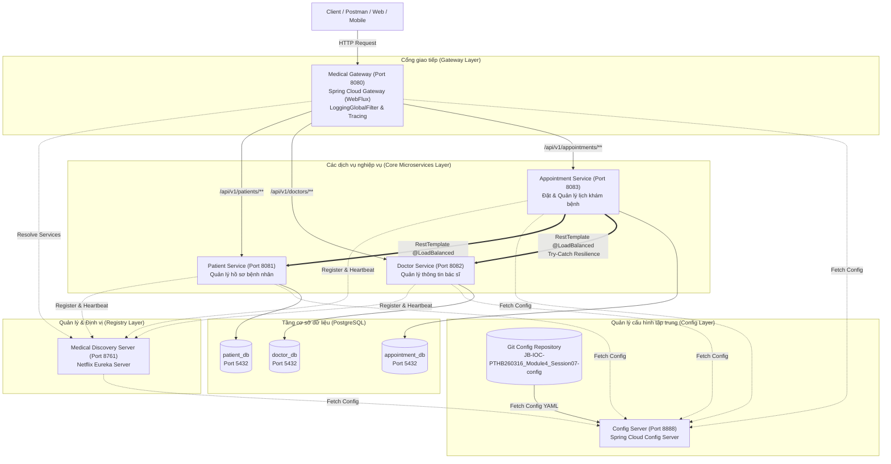

# Hệ Thống Microservices Quản Lý Khám Chữa Bệnh (Medical Healthcare System)

Hệ thống quản lý khám chữa bệnh theo kiến trúc **Microservices** hiện đại, áp dụng đầy đủ các mẫu thiết kế chuẩn doanh nghiệp như **API Gateway**, **Service Discovery (Eureka)**, **Client-Side Load Balancing**, **Distributed Tracing (Correlation ID)**, **DTO Compile-Time Mapping (MapStruct)** và **Fault Tolerance / Resilience (Xử lý sự cố liên dịch vụ)**.

---

## 1. Sơ đồ kiến trúc tổng thể (System Architecture)



---

## 2. Bảng tổng hợp các dịch vụ (Service Matrix)

| Dịch vụ | Cổng | Cơ sở dữ liệu | Vai trò & Trách nhiệm chính | Tài liệu chi tiết |
| :--- | :--- | :--- | :--- | :--- |
| **`config-server`** | `8888` | Không | Quản lý cấu hình tập trung từ Git Repository từ xa | [Git Config Repo](https://github.com/phuongtv275/JB-IOC-PTHB260316_Module4_Session07-config.git) |
| **`medical-discovery-server`** | `8761` | Không | Máy chủ Eureka trung tâm, đăng ký & định vị dịch vụ | [Xem Module](file:///home/trgphun/projects/personal/rikkei/module4/session07/medical-discovery-server) |
| **`medical-gateway`** | `8080` | Không | Cổng tiếp nhận duy nhất, ghi log toàn trình, định tuyến | [Xem Module](file:///home/trgphun/projects/personal/rikkei/module4/session07/medical-gateway) |
| **`patient-service`** | `8081` | `patient_db` | Quản lý hồ sơ bệnh nhân, tiền sử bệnh lý, phân trang | [Xem Module](file:///home/trgphun/projects/personal/rikkei/module4/session07/patient-service) |
| **`doctor-service`** | `8082` | `doctor_db` | Quản lý danh sách bác sĩ, chuyên khoa, kinh nghiệm | [Xem Module](file:///home/trgphun/projects/personal/rikkei/module4/session07/doctor-service) |
| **`appointment-service`** | `8083` | `appointment_db` | Đặt lịch khám, gọi liên dịch vụ, xử lý sự cố server sập | [Xem Module](file:///home/trgphun/projects/personal/rikkei/module4/session07/appointment-service) |

---

## 3. Các tiêu chuẩn kỹ thuật cốt lõi (Core Principles)

Dự án tuân thủ nghiêm ngặt các quy tắc phát triển phần mềm chất lượng cao:

1. **Kiến trúc Web MVC & Clean Code (SOLID):**
   - Phân tách rõ ràng các tầng: `Controller` $\rightarrow$ `Service` $\rightarrow$ `Repository` $\rightarrow$ `Entity`/`DTO`.
   - Mỗi thành phần tuân thủ *Single Responsibility Principle (SRP)* và *Open-Closed Principle (OCP)*.
2. **Distributed Tracing với Correlation ID (`X-Correlation-Id`):**
   - `medical-gateway` tiếp nhận hoặc tự động phát sinh một chuỗi `UUID` làm Correlation ID cho từng request.
   - Header này được truyền xuyên suốt qua tất cả các microservices (`patient-service`, `doctor-service`, `appointment-service`).
   - Từng service tích hợp `CorrelationIdFilter` và SLF4J MDC, hiển thị `[cid:...]` trên từng dòng log để dễ dàng truy vết sự cố phân tán.
3. **Chuyển đổi đối tượng tối ưu với MapStruct 1.6.3:**
   - Hoàn toàn loại bỏ boilerplate code thủ công.
   - Code chuyển đổi DTO $\leftrightarrow$ Entity được tự động sinh lúc biên dịch (Compile-time code generation), đảm bảo an toàn kiểu dữ liệu và tốc độ thực thi tối đa.
4. **Cân bằng tải phía Client (Client-Side Load Balancing):**
   - `appointment-service` sử dụng `RestTemplate` gắn annotation `@LoadBalanced` để phân giải trực tiếp tên logic trên Eureka (`http://patient-service`, `http://doctor-service`).
5. **Khả năng chịu lỗi & Phục hồi (Fault Tolerance / Chaos Resilience):**
   - Lời gọi liên dịch vụ sang `doctor-service` được bảo vệ bằng khối `try-catch`.
   - Khi `doctor-service` gặp sự cố (bị tắt, lỗi server hoặc mất kết nối mạng), `appointment-service` bắt ngoại lệ và trả về JSON chuẩn `ApiResponseError` với HTTP status `503 Service Unavailable` thay vì để lộ lỗi 500 kèm stack trace.
6. **Kiểm tra dữ liệu (Jakarta Bean Validation) & Xử lý lỗi tập trung:**
   - Validate chặt chẽ các trường dữ liệu đầu vào (`@NotBlank`, `@NotNull`, `@Future`, `@Past`, `@Email`...).
   - Bắt và đóng gói toàn bộ lỗi tại `@RestControllerAdvice` (`GlobalExceptionHandler`).
7. **Chuẩn hóa phân trang và định dạng phản hồi:**
   - Toàn bộ danh sách trả về đều được phân trang thông qua `PageResponse<T>` gồm thông tin trang hiện tại, kích thước, tổng số bản ghi và tổng số trang.

---

## 4. Hướng dẫn cài đặt & Khởi chạy hệ thống

### 4.1. Yêu cầu môi trường
- Java Development Kit (JDK) 21 trở lên
- Docker & Docker Compose (hoặc PostgreSQL 16+ cài đặt trực tiếp trên máy)
- Gradle 8.x (đã tích hợp sẵn Gradle Wrapper `gradlew` trong từng service)

### 4.2. Chuẩn bị Cơ sở dữ liệu (PostgreSQL)
Đảm bảo PostgreSQL đang chạy trên cổng `5432` với tài khoản mặc định `postgres` / `123456`. Tạo 3 database cần thiết:
```sql
CREATE DATABASE patient_db;
CREATE DATABASE doctor_db;
CREATE DATABASE appointment_db;
```

*(Lưu ý: Nếu dùng Docker container có sẵn, bạn có thể thực thi lệnh tạo DB bằng `docker exec -it <container_id> psql -U postgres`)*.

### 4.3. Thứ tự khởi động các dịch vụ (RẤT QUAN TRỌNG)

Mở 6 cửa sổ terminal riêng biệt và thực thi lệnh khởi chạy theo đúng thứ tự sau:

#### Bước 1: Khởi động Config Server (Port 8888)
```bash
cd config-server
./gradlew bootRun
```
> Config Server sẽ tải toàn bộ file cấu hình `.yaml` của các service từ Git Repo: `https://github.com/phuongtv275/JB-IOC-PTHB260316_Module4_Session07-config.git`.
> Kiểm tra thử tại trình duyệt: `http://localhost:8888/patient-service/default`.

#### Bước 2: Khởi động Discovery Server (Eureka - Port 8761)
```bash
cd medical-discovery-server
./gradlew bootRun
```
> Đợi đến khi log báo hoàn tất, mở trình duyệt truy cập: `http://localhost:8761` để kiểm tra bảng điều khiển Eureka Dashboard.

#### Bước 3: Khởi động Patient Service (Port 8081)
```bash
cd patient-service
./gradlew bootRun
```

#### Bước 4: Khởi động Doctor Service (Port 8082)
```bash
cd doctor-service
./gradlew bootRun
```
*(Service sẽ tự động khởi tạo sẵn 5 bác sĩ mẫu vào `doctor_db` qua `DataInitializer`).*

#### Bước 5: Khởi động Appointment Service (Port 8083)
```bash
cd appointment-service
./gradlew bootRun
```

#### Bước 6: Khởi động Medical Gateway (Port 8080)
```bash
cd medical-gateway
./gradlew bootRun
```
> Kiểm tra lại Eureka Dashboard tại `http://localhost:8761`. Toàn bộ 4 dịch vụ nghiệp vụ (`MEDICAL-GATEWAY`, `PATIENT-SERVICE`, `DOCTOR-SERVICE`, `APPOINTMENT-SERVICE`) đều phải hiển thị trạng thái `UP`.

---

## 5. Danh mục API Gateway (gọi qua Port 8080)

Tất cả các API của hệ thống đều được định tuyến thông qua **Medical Gateway** tại địa chỉ: `http://localhost:8080`.

### 5.1. Nhóm API Quản lý Bệnh nhân (`/api/v1/patients`)
- **Tạo mới bệnh nhân:**
  - `POST http://localhost:8080/api/v1/patients`
  - Body:
    ```json
    {
      "fullName": "Nguyễn Văn An",
      "dateOfBirth": "1992-08-15",
      "gender": "Nam",
      "phoneNumber": "0981234567",
      "address": "Số 10 Tràng Thi, Hoàn Kiếm, Hà Nội",
      "medicalHistory": "Dị ứng Penicillin, bệnh nền huyết áp nhẹ"
    }
    ```
- **Lấy danh sách bệnh nhân (Phân trang):**
  - `GET http://localhost:8080/api/v1/patients?page=0&size=10&sortBy=id&sortDir=desc`
- **Lấy chi tiết bệnh nhân theo ID:**
  - `GET http://localhost:8080/api/v1/patients/{id}`

### 5.2. Nhóm API Quản lý Bác sĩ (`/api/v1/doctors`)
- **Lấy danh sách bác sĩ (Mặc định trả về id, name, specialization):**
  - `GET http://localhost:8080/api/v1/doctors?page=0&size=10`
  - Tùy chọn lọc: `specialization=Nội khoa`, `status=true`, `detail=true` (để lấy đầy đủ email, kinh nghiệm).
- **Lấy chi tiết bác sĩ theo ID:**
  - `GET http://localhost:8080/api/v1/doctors/{id}`
- **Thêm mới bác sĩ:**
  - `POST http://localhost:8080/api/v1/doctors`
  - Body:
    ```json
    {
      "name": "BS. Đỗ Minh Quân",
      "specialization": "Tai Mũi Họng",
      "experienceYears": 8,
      "email": "quan.do@hospital.com",
      "status": true
    }
    ```

### 5.3. Nhóm API Đặt lịch khám (`/api/v1/appointments` & `/api/v1/appointment`)
- **Đặt lịch khám bệnh mới:**
  - `POST http://localhost:8080/api/v1/appointments` (hoặc `/api/v1/appointment`)
  - Body:
    ```json
    {
      "patientId": 1,
      "doctorId": 1,
      "appointmentDate": "2026-09-20T09:30:00",
      "reason": "Khám định kỳ tổng quát và kiểm tra huyết áp"
    }
    ```
- **Lấy danh sách lịch khám (Phân trang & Lọc):**
  - `GET http://localhost:8080/api/v1/appointments?page=0&size=10&status=PENDING`
- **Lấy chi tiết một lịch khám:**
  - `GET http://localhost:8080/api/v1/appointments/{id}`

---

## 6. Kịch bản kiểm thử tích hợp & Chịu lỗi (Resilience Test)

### Kịch bản 1: Đặt lịch khám thành công (Happy Path)
1. Tạo 1 bệnh nhân qua `POST http://localhost:8080/api/v1/patients` $\rightarrow$ Nhận được `patientId: 1`.
2. Kiểm tra danh sách bác sĩ qua `GET http://localhost:8080/api/v1/doctors` $\rightarrow$ Có sẵn bác sĩ `doctorId: 1`.
3. Đặt lịch khám qua `POST http://localhost:8080/api/v1/appointments` với `patientId: 1`, `doctorId: 1`.
4. **Kết quả:** Nhận HTTP 201 Created cùng thông tin chi tiết lịch hẹn trạng thái `PENDING`.

---

### Kịch bản 2: Bệnh nhân hoặc Bác sĩ không tồn tại (Validation / 404)
1. Gửi request đặt lịch với `doctorId: 999` (không tồn tại trong CSDL).
2. **Kết quả:** `appointment-service` bắt được lỗi 404 từ `doctor-service` và trả về thông báo lỗi rõ ràng:
```json
{
  "success": false,
  "message": "Không tìm thấy bác sĩ với ID: 999 trong hệ thống",
  "correlationId": "...",
  "timestamp": "..."
}
```

---

### Kịch bản 3: Mô phỏng sự cố Doctor Service bị sập (Chaos Engineering / 503)
1. **Mô phỏng sự cố:** Tắt tiến trình `doctor-service` (dừng terminal của doctor-service).
2. Dùng Postman hoặc cURL gửi request đặt lịch khám qua Gateway:
   ```bash
   curl -X POST http://localhost:8080/api/v1/appointments \
     -H "Content-Type: application/json" \
     -d '{
       "patientId": 1,
       "doctorId": 1,
       "appointmentDate": "2026-09-20T09:30:00",
       "reason": "Khám tổng quát"
     }'
   ```
3. **Kết quả mong muốn:** Hệ thống không bị treo hay trả về lỗi 500 loằng ngoằng, mà trả về ngay lập tức phản hồi HTTP 503 Service Unavailable đúng chuẩn:
   ```json
   {
     "timestamp": "2026-09-14T11:45:10",
     "status": 503,
     "error": "Service Unavailable",
     "message": "Hệ thống quản lý bác sĩ hiện không khả dụng. Vui lòng đặt lịch sau!"
   }
   ```

---

## 7. Chạy kiểm thử tự động toàn bộ dự án

Mỗi dịch vụ đều được trang bị bộ kiểm thử tự động bao phủ toàn diện từ Repository, Service đến Controller:

```bash
# Kiểm thử Config Server
cd config-server && ./gradlew test && cd ..

# Kiểm thử Medical Discovery Server (Eureka)
cd medical-discovery-server && ./gradlew test && cd ..

# Kiểm thử Patient Service (11 test cases)
cd patient-service && ./gradlew test && cd ..

# Kiểm thử Doctor Service (13 test cases)
cd doctor-service && ./gradlew test && cd ..

# Kiểm thử Appointment Service (13 test cases)
cd appointment-service && ./gradlew test && cd ..

# Kiểm thử Medical Gateway (3 test cases)
cd medical-gateway && ./gradlew test && cd ..
```

